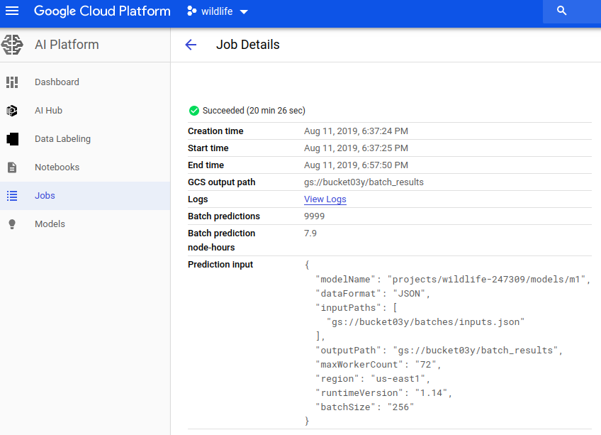

# vision-client
[](https://gitpod.io/#https://github.com/louis030195/vision-client)

# Front end


# Pipeline


# Performances




# Installation
Work with:
- https://github.com/louis030195/vision-client/tree/master/tfrecord-builder
- https://github.com/louis030195/frame-extractor

It is recommended to just use GitPod for development, there is less setup to do but you can also do locally

see [bash script](setup.sh) to configure everything automatically (not full yet)

## Local development
### [Install NodeJS](https://www.google.com/search?ei=D3Q4XZGcM8OHjLsPs--n8AM&q=install+nodejs)

    git clone https://github.com/louis030195/vision-client.git
    cd vision-client
    npm install


### gcloud CLI
    echo "deb [signed-by=/usr/share/keyrings/cloud.google.gpg] https://packages.cloud.google.com/apt cloud-sdk main" | sudo tee -a /etc/apt/sources.list.d/google-cloud-sdk.list \
    && curl https://packages.cloud.google.com/apt/doc/apt-key.gpg | sudo apt-key --keyring /usr/share/keyrings/cloud.google.gpg add - \
    && sudo apt-get update \
    && sudo apt-get install -y google-cloud-sdk \
    && sudo rm -rf /var/lib/apt/lists/*

- [Get my OAuth2 IDs](https://developers.google.com/identity/protocols/OAuth2)
- [Get a json key file and put it in key_account directory](https://cloud.google.com/docs/authentication/getting-started)


### Create GCP storage bucket
    gsutil mb gs://[BUCKET_NAME]/ \
    --regions [YOUR_REGION]
    gsutil defacl set public-read gs://[YOUR-BUCKET-NAME]

### Config file
    echo -e '{
        "BUCKET_NAME: "[YOUR_BUCKET]",
        "OAUTH2_CLIENT_ID": "[YOUR_OAUTH2_CLIENT_ID]",
        "OAUTH2_CLIENT_SECRET": "[YOUR_OAUTH2_CLIENT_SECRET]",
        "OAUTH2_CALLBACK": "https://vision-client-dot-[PROJECT_ID].appspot.com/auth/google/callback",
        "GOOGLE_APPLICATION_CREDENTIALS": "./key_account/[JSON__KEY_NAME]",
        "PROJECT_ID": "[YOUR_PROJECT_ID]"
    }' > config.json

### Deploy an object detection model to AI Platform
- Pick a model from [tensorflow models](https://github.com/tensorflow/models/blob/master/research/object_detection/g3doc/detection_model_zoo.md)
or somewhere else (AI Platform deployable format: SavedModel)

- [Update the graph for batch key mapping and upload to GCS](https://colab.research.google.com/drive/1CZxrvowmuzwfJJoUBjgIjsIpb-1gh53h)

- [Push class mapping to datastore](https://colab.research.google.com/drive/1JLJt4tUXNgeuq3Y9PPvZitBS2B7J7Ker)

```
gcloud ai-platform models create m1 \
--regions [YOUR_REGION]

gcloud ai-platform versions create v1 \
    --model m1 \
    --origin gs://[BUCKET_NAME]/saved_model \
    --runtime-version 1.14 \
    --python-version 2.7
```

### Deploy Cloud Function

Edit [FUNCTION_DIR]/.env.yaml with your GCP config
#### TFRecord Caller
    gcloud functions deploy tfrecord_caller \
    --source cloud_functions/tfrecord_caller \
    --runtime python37 \
    --project [PROJECT_ID] \
    --trigger-resource gs://[BUCKET_NAME] \
    --region [YOUR_REGION] \
    --trigger-event google.storage.object.finalize \
    --env-vars-file cloud_functions/tfrecord_caller/.env.yaml \
    --max-instances 1
#### Online
    gcloud functions deploy online_prediction \
    --source cloud_functions/online \
    --runtime python37 \
    --project [PROJECT_ID] \
    --trigger-resource gs://[BUCKET_NAME] \
    --region [YOUR_REGION] \
    --trigger-event google.storage.object.finalize \
    --env-vars-file cloud_functions/online/.env.yaml \
    --max-instances 1
#### Batch
    gcloud functions deploy batch_prediction \
    --source cloud_functions/batch \
    --runtime python37 \
    --project [PROJECT_ID] \
    --trigger-resource gs://[BUCKET_NAME] \
    --region [YOUR_REGION] \
    --trigger-event google.storage.object.finalize \
    --env-vars-file cloud_functions/batch/.env.yaml \
    --max-instances 1
#### Online + Batch
    gcloud functions deploy online_batch_prediction \
    --source cloud_functions/online_batch \
    --runtime python37 \
    --project [PROJECT_ID] \
    --trigger-resource gs://[BUCKET_NAME] \
    --region [YOUR_REGION] \
    --trigger-event google.storage.object.finalize \
    --env-vars-file cloud_functions/online_batch/.env.yaml \
    --max-instances 1 \
    --memory 2gb
#### Batch result
    gcloud functions deploy batch_result \
    --source cloud_functions/batch_result \
    --runtime python37 \
    --project [PROJECT_ID] \
    --trigger-resource gs://[BUCKET_NAME] \
    --region [YOUR_REGION] \
    --trigger-event google.storage.object.finalize \
    --env-vars-file cloud_functions/batch_result/.env.yaml \
    --max-instances 1 \
    --memory 2gb
#### Frame extractor
    gcloud functions deploy extractPubSub \
    --source cloud_functions/frame_extractor \
    --runtime nodejs10 \
    --project [PROJECT_ID] \
    --trigger-topic topic_extractor \
    --region [YOUR_REGION] \
    --env-vars-file cloud_functions/frame_extractor/.env.yaml \
    --max-instances 1 \
    --memory 2gb
#### Dont take all my money
follow [to avoid having your bank account emptied by Google](https://cloud.google.com/billing/docs/how-to/notify#set_up_budget_notifications)

THIS HASNT BEEN TESTED YET SO FOLLOW THE LINK INSTRUCTIONS CAREFULLY

    gcloud functions deploy stop_billing \
    --source cloud_functions/dont_take_all_my_money \
    --runtime python37 \
    --project [PROJECT_ID] \
    --trigger-topic budget-notifications \
    --region [YOUR_REGION] \
    --env-vars-file cloud_functions/dont_take_all_my_money/.env.yaml
Or

    gcloud functions deploy limit_use \
    --source cloud_functions/dont_take_all_my_money \
    --runtime python37 \
    --project [PROJECT_ID] \
    --trigger-topic budget-notifications \
    --region [YOUR_REGION] \
    --env-vars-file cloud_functions/dont_take_all_my_money/.env.yaml
### Deploy to Google Cloud App engine

    gcloud config set project [PROJECT_ID]
    gcloud app deploy

# TODO
- Script that configure all the repo + gcp automatically
- Split back / front
- Let user choose whether he wants online / batch predictions
- Reset / remake new predictions (new model ...)
- Time / price estimator / simulator (before launching the task and after also)
- Think about the case: calls to back API directly (without passing from front)
- Stuff with dates, count, stats ...
- More vizualisation / stats / graphics
- LOGS LOGS LOGS
- ...

# Other informations about models
## Upload frames fast from colab
- [Multithread upload colab directly request back](https://colab.research.google.com/drive/1b6i1Vq-CK52cWUyyTgICJOxr_UeXzE70)
## Object detection models
- [github/tensorflow/models](https://github.com/tensorflow/models/blob/master/research/object_detection)
- [tfhub](https://tfhub.dev/s?module-type=image-object-detection)
## Check graph of a SavedModel

    git clone https://github.com/tensorflow/tensorflow
    python tensorflow/tensorflow/python/tools/saved_model_cli.py show --dir ssd_mobilenet_v1_coco_2018_01_28/saved_model --all


## AI Platform is limited to 250 mb models
[Optimizing models](https://medium.com/google-cloud/optimizing-tensorflow-models-for-serving-959080e9ddbf)

# Some tools
- [tools](tools/README.md)