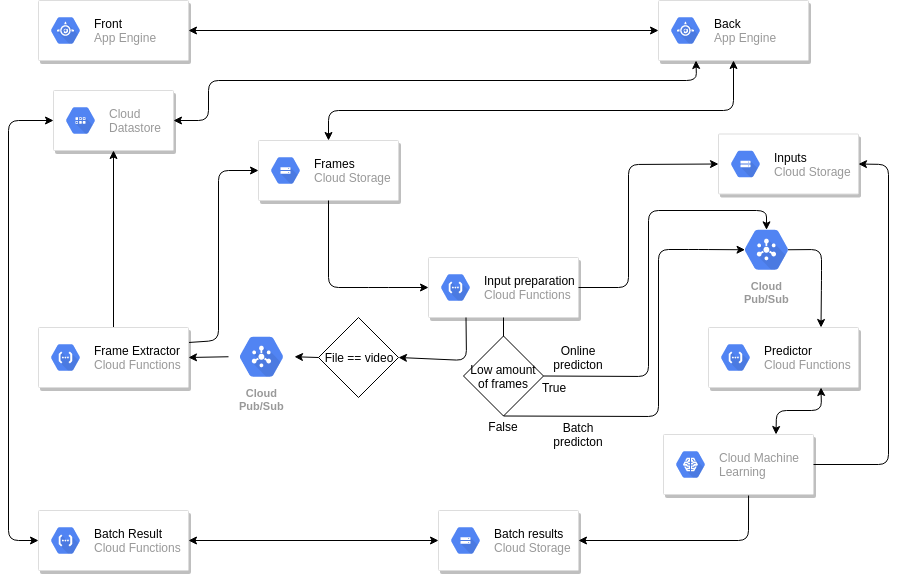

# vision-client
[](https://gitpod.io/#https://github.com/louis030195/vision-client)

# Front end
Using [Lit-Element](https://lit-element.polymer-project.org/)


# Pipeline



# Pricing

[see](docs/PRICING.md)

# Performances

[see](docs/PERFORMANCES.md)

# Usage

see [bash script](configure_gcp_and_deploy.sh) to configure everything automatically (not tested yet)

## Environment variables

    export PROJECT_ID=
    export REGION=
    export BUCKET_NAME=
    export MODEL=
    export VERSION=
    export OAUTH2_CLIENT_ID=
    export OAUTH2_CLIENT_SECRET=
    export OAUTH2_CALLBACK=
    export GOOGLE_APPLICATION_CREDENTIALS=

- [Get my OAuth2 IDs](https://developers.google.com/identity/protocols/OAuth2)
- [Get a json key file and put it in key_account directory](https://cloud.google.com/docs/authentication/getting-started)

## Create the App Engine config file
    echo -e "service: vision-client
    runtime: custom
    env: flex
    instance_class: F2

    # GCP Config
    env_variables:
        PROJECT_ID: $PROJECT_ID
        BUCKET_NAME: $BUCKET_NAME
        REGION: $REGION
        OAUTH2_CLIENT_ID: $OAUTH2_CLIENT_ID
        OAUTH2_CLIENT_SECRET: $OAUTH2_CLIENT_SECRET
        OAUTH2_CALLBACK: $OAUTH2_CALLBACK
        GOOGLE_APPLICATION_CREDENTIALS: $GOOGLE_APPLICATION_CREDENTIALS" > app.yaml

For webpack

    echo -e "PROJECT_ID=$PROJECT_ID
    BUCKET_NAME=$BUCKET_NAME
    REGION=$REGION
    OAUTH2_CLIENT_ID=$OAUTH2_CLIENT_ID
    OAUTH2_CLIENT_SECRET=$OAUTH2_CLIENT_SECRET
    OAUTH2_CALLBACK=$OAUTH2_CALLBACK
    GOOGLE_APPLICATION_CREDENTIALS=$GOOGLE_APPLICATION_CREDENTIALS" > .env

## gcloud CLI
    echo "deb [signed-by=/usr/share/keyrings/cloud.google.gpg] https://packages.cloud.google.com/apt cloud-sdk main" | sudo tee -a /etc/apt/sources.list.d/google-cloud-sdk.list \
    && curl https://packages.cloud.google.com/apt/doc/apt-key.gpg | sudo apt-key --keyring /usr/share/keyrings/cloud.google.gpg add - \
    && sudo apt-get update \
    && sudo apt-get install -y google-cloud-sdk \
    && sudo rm -rf /var/lib/apt/lists/*

## Create GCP storage bucket
    gsutil mb gs://$BUCKET_NAME/ \
    --regions $REGION
    gsutil defacl set public-read gs://$BUCKET_NAME

## Deploy an object detection model to AI Platform
- Pick a model from [tensorflow models](https://github.com/tensorflow/models/blob/master/research/object_detection/g3doc/detection_model_zoo.md)
or somewhere else (AI Platform deployable format: SavedModel)

- [Update the graph for batch key mapping and upload to GCS](https://colab.research.google.com/drive/1CZxrvowmuzwfJJoUBjgIjsIpb-1gh53h)

- [Push class mapping to datastore](https://colab.research.google.com/drive/1JLJt4tUXNgeuq3Y9PPvZitBS2B7J7Ker)

```
gcloud -q ai-platform versions delete $VERSION --model $MODEL
gcloud -q ai-platform models delete $MODEL
gcloud ai-platform models create $MODEL \
--regions $REGION

gcloud ai-platform versions create $VERSION \
    --model $MODEL \
    --origin gs://$BUCKET_NAME/saved_model \
    --runtime-version 1.14 \
    --python-version 2.7
```

## Deploy Cloud Function

Edit [FUNCTION_DIR]/.env.yaml with your GCP config
### Input Pub/Sub
    gcloud functions deploy input_pubsub \
    --source cloud_functions/input_pubsub \
    --runtime python37 \
    --project $PROJECT_ID \
    --trigger-http \
    --region $REGION \
    --env-vars-file cloud_functions/input_pubsub/.env.yaml \
    --max-instances 1 \
    --memory 2gb
### Predictor
    gcloud functions deploy predictor \
    --source cloud_functions/predictor \
    --runtime python37 \
    --project $PROJECT_ID \
    --trigger-topic topic_input \
    --region $REGION \
    --env-vars-file cloud_functions/predictor/.env.yaml \
    --max-instances 1 \
    --memory 2gb
### Batch result
    gcloud functions deploy batch_result \
    --source cloud_functions/batch_result \
    --runtime python37 \
    --project $PROJECT_ID \
    --trigger-resource gs://$BUCKET_NAME \
    --region $REGION \
    --trigger-event google.storage.object.finalize \
    --env-vars-file cloud_functions/batch_result/.env.yaml \
    --max-instances 1 \
    --memory 2gb
### Frame extractor
    gcloud functions deploy extractPubSub \
    --source cloud_functions/frame_extractor \
    --runtime nodejs10 \
    --project $PROJECT_ID \
    --trigger-topic topic_extractor \
    --region $REGION \
    --env-vars-file cloud_functions/frame_extractor/.env.yaml \
    --max-instances 1 \
    --memory 2gb
### Dont take all my money
follow [to avoid having your bank account emptied by Google](https://cloud.google.com/billing/docs/how-to/notify#set_up_budget_notifications)

THIS HASNT BEEN TESTED YET SO FOLLOW THE LINK INSTRUCTIONS CAREFULLY

    gcloud functions deploy stop_billing \
    --source cloud_functions/dont_take_all_my_money \
    --runtime python37 \
    --project $PROJECT_ID \
    --trigger-topic budget-notifications \
    --region $REGION \
    --env-vars-file cloud_functions/dont_take_all_my_money/.env.yaml
Or

    gcloud functions deploy limit_use \
    --source cloud_functions/dont_take_all_my_money \
    --runtime python37 \
    --project $PROJECT_ID \
    --trigger-topic budget-notifications \
    --region $REGION \
    --env-vars-file cloud_functions/dont_take_all_my_money/.env.yaml
## Deploy to Google Cloud App engine

    gcloud config set project $PROJECT_ID
    gcloud app deploy

# Development
It is highly recommended to just use GitPod for development, there is less setup to do but you can also do locally

export the environment variables from above, in addition, those too:

    export PORT=8080
    export SECRET=keyboardcat

## Local development
- [Install NodeJS](https://www.google.com/search?ei=D3Q4XZGcM8OHjLsPs--n8AM&q=install+nodejs)

```
git clone https://github.com/louis030195/vision-client.git
cd vision-client
npm install
```

# TODO
- Script that configure all the repo + gcp automatically
- Split back / front
- Reset / remake new predictions (new model ...)
- Time / price estimator / simulator (before launching the task and after also)
- Stuff with dates, count, stats ...
- More vizualisation / stats / graphics
- LOGS LOGS LOGS
- Datastore callbacks (E.g delete frame => delete its predictions+objects see [doc](https://cloud.google.com/appengine/docs/standard/java/datastore/callbacks#top_of_page))
- ...

# Other informations about models
## Upload frames fast from colab
- [Multithread upload colab directly request back](https://colab.research.google.com/drive/1b6i1Vq-CK52cWUyyTgICJOxr_UeXzE70)
## Object detection models
- [github/tensorflow/models](https://github.com/tensorflow/models/blob/master/research/object_detection)
- [tfhub](https://tfhub.dev/s?module-type=image-object-detection)
## Check graph of a SavedModel

    git clone https://github.com/tensorflow/tensorflow
    python tensorflow/tensorflow/python/tools/saved_model_cli.py show --dir ssd_mobilenet_v1_coco_2018_01_28/saved_model --all


## AI Platform is limited to 250 mb models
[Optimizing models](https://medium.com/google-cloud/optimizing-tensorflow-models-for-serving-959080e9ddbf)

# Some tools
- [tools](tools/README.md)