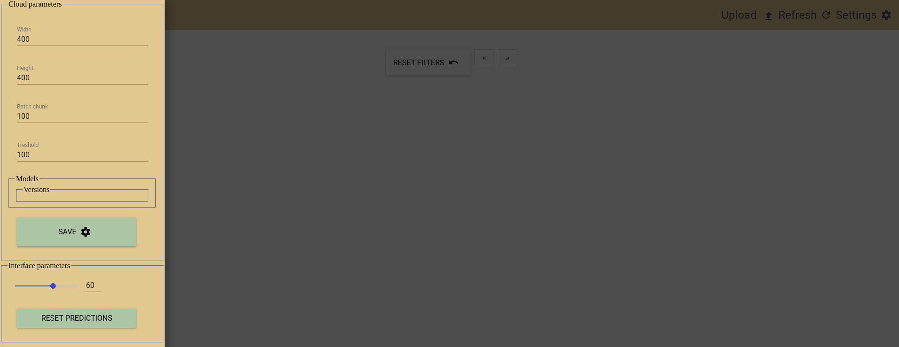

# Cloud computer vision

- [See medium blog post](https://medium.com/@louis.beaumont/cloud-computer-vision-for-wildlife-monitoring-a50bfee6bef5)
- [See video](https://www.youtube.com/watch?v=b2P8ez4Q68I)
# Front end
Using [Lit-Element](https://lit-element.polymer-project.org/)

# Pipeline
DIAGRAM KINDA OUT-OF-DATE

# Documentation

- [Pricing](docs/PRICING.md)

- [Performances](docs/PERFORMANCES.md)

- [Usage](docs/USAGE.md)

- [Development](docs/DEVELOPMENT.md)

- [Other useful information](docs/OTHER.md)

# Contact

Send me an email louis.beaumont@gmail.com if you wish to setup this in production for your company, some associations (wildlife protection, surveillance ...)... (depending on the mission / time required i might do it for free)