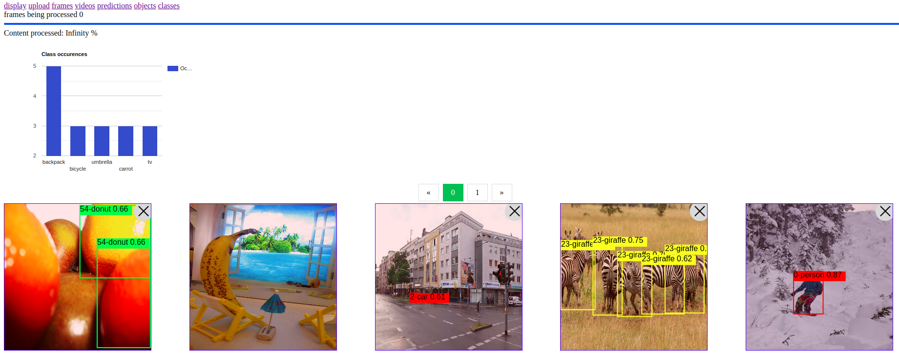
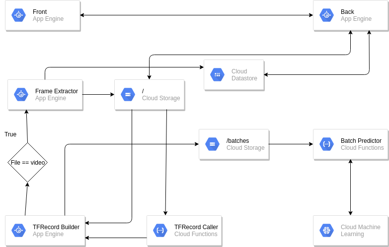

# vision-client
## Lot of refactors atm may not work properly
[](https://gitpod.io/#https://github.com/louis030195/vision-client)



# Objective



# Installation
Work with:
- https://github.com/louis030195/vision-client/tree/master/tfrecord-builder
- https://github.com/louis030195/frame-extractor

It is recommended to just use GitPod, there is less setup to do but you can also do local dev
## Local development
### [Install NodeJS](https://www.google.com/search?ei=D3Q4XZGcM8OHjLsPs--n8AM&q=install+nodejs)
```
git clone https://github.com/louis030195/vision-client.git
cd vision-client
npm install
```

### gcloud CLI
```
echo "deb [signed-by=/usr/share/keyrings/cloud.google.gpg] https://packages.cloud.google.com/apt cloud-sdk main" | sudo tee -a /etc/apt/sources.list.d/google-cloud-sdk.list \
 && curl https://packages.cloud.google.com/apt/doc/apt-key.gpg | sudo apt-key --keyring /usr/share/keyrings/cloud.google.gpg add - \
 && sudo apt-get update \
 && sudo apt-get install -y google-cloud-sdk \
 && sudo rm -rf /var/lib/apt/lists/*
```

- [Get my OAuth2 IDs](https://developers.google.com/identity/protocols/OAuth2)
- [Get a json key file and put it in key_account directory](https://cloud.google.com/docs/authentication/getting-started)

### Create GCP storage bucket
```
gsutil mb gs://[BUCKET_NAME]/ \
--regions [YOUR_REGION]
gsutil defacl set public-read gs://[YOUR-BUCKET-NAME]
```

### Config file
```
echo -e '{
    "CLOUD_BUCKET": "[YOUR_BUCKET]",
    "OAUTH2_CLIENT_ID": "[YOUR_OAUTH2_CLIENT_ID]",
    "OAUTH2_CLIENT_SECRET": "[YOUR_OAUTH2_CLIENT_SECRET]",
    "OAUTH2_CALLBACK": "https://[PROJECT_ID].appspot.com/auth/google/callback",
    "GOOGLE_APPLICATION_CREDENTIALS": "./key_account/[JSON__KEY_NAME]",
    "PROJECT_ID": "[YOUR_PROJECT_ID]"
}' > config.json
```

### Deploy an object detection model to AI Platform
```
curl -o model.tar.gz http://download.tensorflow.org/models/object_detection/ssd_mobilenet_v1_coco_2018_01_28.tar.gz
tar xvf model.tar.gz
gsutil -m cp -r ssd_mobilenet_v1_coco_2018_01_28/saved_model gs://[BUCKET_NAME]/

gcloud ai-platform models create m1 \
--regions [YOUR_REGION]

gcloud ai-platform versions create v1 \
    --model m1 \
    --origin gs://[BUCKET_NAME]/saved_model \
    --runtime-version 1.14 \
    --python-version 2.7
```

### Deploy Cloud Function

Replace in cloud_functions/*.py your GCP parameters
## Online
```
gcloud functions deploy online_processing \
--source cloud_functions/online \
--runtime python37 \
--project [PROJECT_ID] \
--trigger-resource gs://[BUCKET_NAME] \
--region [YOUR_REGION] \
--trigger-event google.storage.object.finalize
```
## Batches
```
gcloud functions deploy batch_processing \
--source cloud_functions/batch \
--runtime python37 \
--project [PROJECT_ID] \
--trigger-resource gs://[BUCKET_NAME] \
--region [YOUR_REGION] \
--trigger-event google.storage.object.finalize \
--memory 2gb
```
### Deploy to Google Cloud App engine
```
gcloud app deploy
```

# TODO
- Script that configure all the repo + gcp automatically
- Batch prediction
- Videos
- Stuff with dates, count, stats ...
- ...

# Other informations about models
## Object detection models
- [github/tensorflow/models](https://github.com/tensorflow/models/blob/master/research/object_detection)
- [tfhub](https://tfhub.dev/s?module-type=image-object-detection)
## Check graph of a SavedModel
```
# https://github.com/tensorflow/tensorflow
python tensorflow/tensorflow/python/tools/saved_model_cli.py show --dir ssd_mobilenet_v1_coco_2018_01_28/saved_model --all
```

## AI Platform is limited to 250 mb models
[Optimizing models](https://medium.com/google-cloud/optimizing-tensorflow-models-for-serving-959080e9ddbf)

# Some tools
- [tools](tools/README.md)